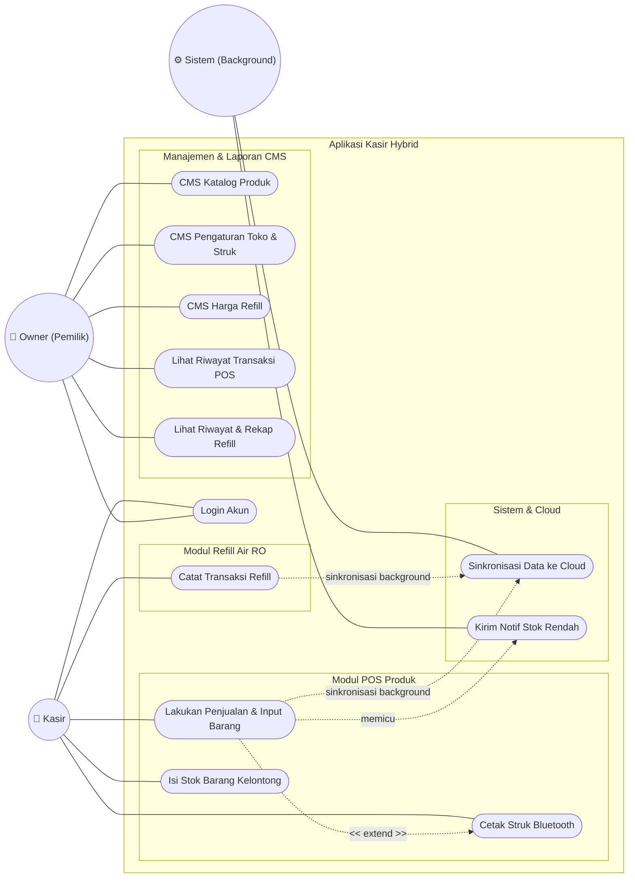

# Use Case Diagram: Sistem Kasir & Refill Air RO Hybrid

Dokumen ini memuat diagram Use Case beserta penjelasannya untuk **Sistem Kasir Warung 3D Water RO** berdasarkan *Implementation Plan v1.1*. Aplikasi ini memiliki dua modul utama yang independen: Modul POS Produk dan Modul Refill Air RO, serta berjalan secara *offline-first* dengan sinkronisasi ke cloud.

## 1. Gambar Use Case Diagram

---

## 2. Penjelasan Aktor

1. **Owner (Pemilik)**: Aktor yang memiliki hak akses penuh (*super-user*). Owner berwenang mengubah data master (CMS Katalog, CMS Harga, CMS Pengaturan Toko/Struk) dan melihat seluruh riwayat serta rekapitulasi penjualan.
2. **Kasir (Staf)**: Aktor operasional yang hanya memiliki akses untuk melakukan transaksi harian. Hak aksesnya dibatasi pada Modul POS (melayani pembelian barang & cetak struk) dan Modul Refill (mencatat isi ulang air).
3. **Sistem (Background)**: Aktor sekunder yang bekerja di latar belakang (sinkronisasi data ke cloud dan notifikasi).

## 3. Penjelasan Use Case

### A. Autentikasi
*   **Login Akun**: Kasir maupun Owner wajib masuk ke aplikasi menggunakan Email dan Password. Sistem akan mendeteksi peran (role) dari akun tersebut dan mengarahkan ke tampilan menu yang sesuai.

### B. Modul POS & Refill (Fokus Operasional: Kasir)
Peran Kasir sangat vital pada tahap eksekusi harian secara langsung dengan pelanggan. Berikut adalah penjabaran detail wewenang Kasir:

1. **Penjualan Produk Kelontong (POS)**:
   *   **Menginput Barang yang Akan Dijual**: Kasir dengan sigap memasukkan produk-produk fisik yang dibawa pelanggan ke dalam keranjang belanja sistem (melalui pencarian atau *scroll* katalog visual).
   *   **Proses Transaksi & Pembayaran**: Sistem mengalkulasi total belanjaan; Kasir kemudian menginput jumlah nominal uang tunai yang diserahkan pelanggan untuk memunculkan otomatis perhitungan kembalian uang.
   *   **Isi Stok Barang**: Selain transaksi keluar, Kasir diberikan wewenang untuk memasukkan/memperbarui (isi ulang) angka ketersediaan fisik stok produk di laci etalase agar sinkronisasi jumlah stok selalu tercatat *real-time* di sistem.
   *   **Cetak Struk**: Menekan tombol cetak yang akan mentransfer data tagihan menjadi format nota melalui printer *thermal bluetooth*.

2. **Isi Ulang Air Reverse Osmosis (Refill)**:
   *   **Memasukkan Transaksi Isi Ulang Air**: Berbeda dengan produk kelontong yang perlu masuk keranjang, pencatatan air RO dilakukan dalam alur lebih cepat. Kasir cukup masuk ke layar Air RO, menanyakan atau melihat ukuran tempat air pelanggan (misal Galon 19L, jerigen 10L, 5L), dan menekan opsi volume tersebut.
   *   **Penyimpanan Otomatis**: Transaksi pengisian ulang langsung ditutup/disimpan ke database mandiri (Refill) begitu volume ditekan dengan menarik acuan harga yang sudah ditetapkan di CMS.

### C. Modul CMS & Laporan (Akses Khusus Owner)
*   **CMS Katalog Produk**: Owner menambah, mengubah, atau menghapus data produk (harga, stok).
*   **CMS Pengaturan Toko & Struk**: Owner mengatur detail toko (nama, alamat, teks struk) yang akan tercetak.
*   **CMS Harga Refill**: Owner mengatur tarif per volume air RO.
*   **Lihat Riwayat Transaksi POS**: Owner dapat memantau jejak seluruh transaksi POS yang telah diselesaikan.
*   **Lihat Riwayat & Rekap Refill**: Owner dapat melihat pencatatan refill secara rinci beserta total pendapatan bulanan.

### D. Sistem & Cloud (Proses Otomatis)
*   **Sinkronisasi Data ke Cloud**: Sistem *push* transaksi lokal ke Firestore secara *background*.
*   **Kirim Notif Stok Rendah**: Sistem memicu FCM mengirim pesan peringatan stok menipis ke *device* Owner.
