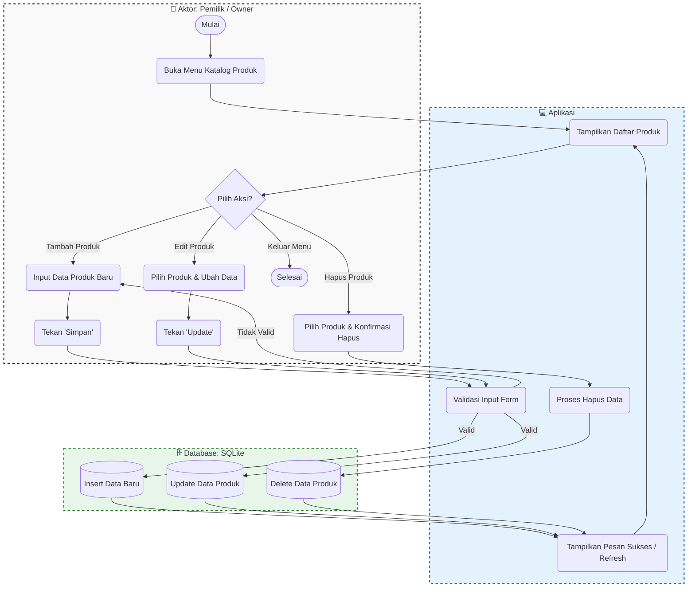
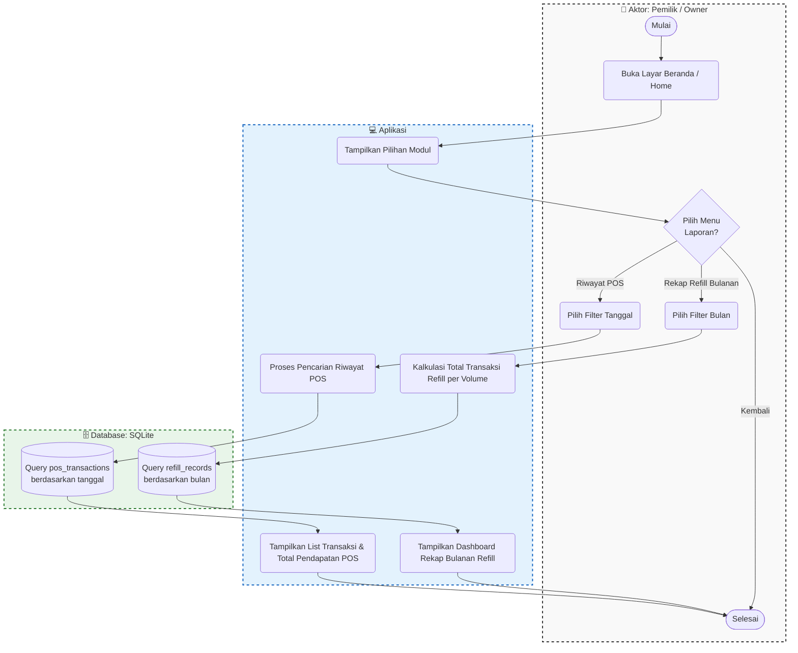

# Activity Diagram: Pemilik / Owner (CRUD & Laporan)

Dokumen ini memuat Activity Diagram yang menggambarkan alur kerja manajerial yang dilakukan oleh Pemilik (Owner), meliputi proses Create, Read, Update, Delete (CRUD) untuk Katalog Produk serta proses melihat Laporan/Rekapitulasi transaksi.

## 1. Activity Diagram: Manajemen Katalog Produk (CRUD)

Diagram ini menunjukkan alur ketika Owner ingin menambah produk baru, mengedit harga/stok, atau menghapus produk dari katalog.

---

## 2. Activity Diagram: Laporan & Rekapitulasi (Lain-lain)

Diagram ini menunjukkan alur ketika Owner meninjau riwayat penjualan (Modul POS) dan rekapitulasi bulanan (Modul Refill Air RO).

