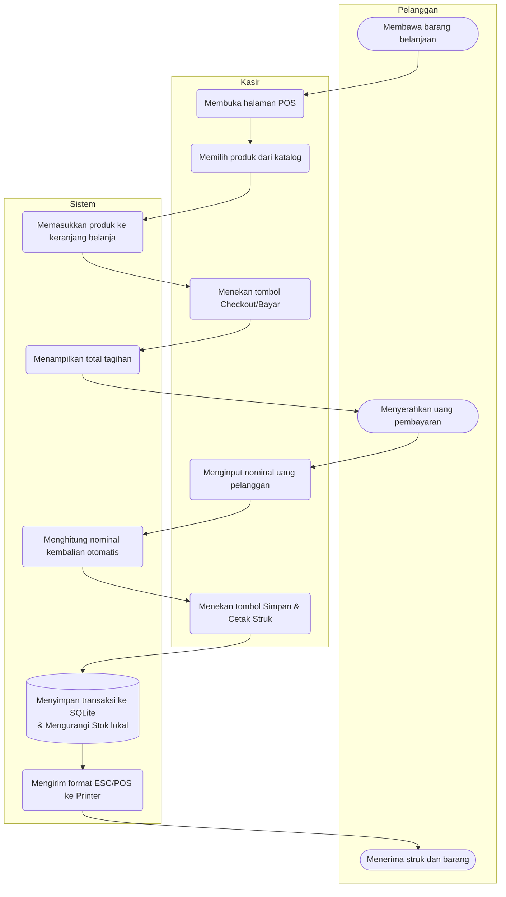

# Activity Diagram: Modul POS (Kasir Kelontong)

Dokumen ini memuat Activity Diagram (Diagram Aktivitas) yang menggambarkan alur kerja langkah demi langkah untuk satu siklus transaksi di Modul POS Produk, mulai dari pemilihan barang hingga proses mencetak struk.

## 1. Gambar Activity Diagram

---

## 2. Penjelasan Alur (Activity Flow)

Diagram di atas menjelaskan alur interaksi Kasir pada fitur **Point of Sales (POS)**:

1. **Mulai Transaksi**: Kasir masuk ke halaman utama POS yang menampilkan grid/daftar produk kelontong.
2. **Pilih Produk & Masuk Keranjang**: Kasir menyentuh item produk yang dibeli oleh pelanggan. Sistem secara otomatis akan memasukkannya ke dalam *Cart* (Keranjang).
   - *Looping*: Jika pelanggan membeli lebih dari satu barang, kasir dapat terus memilih produk lain.
3. **Checkout / Bayar**: Setelah semua barang dimasukkan, kasir menekan tombol bayar untuk beralih ke layar konfirmasi keranjang.
4. **Input Pembayaran**: Sistem menampilkan total tagihan. Kasir kemudian menginput jumlah uang tunai yang diberikan oleh pelanggan.
5. **Kalkulasi Kembalian**: Sistem akan menghitung otomatis nominal uang kembalian yang harus diberikan kasir kepada pelanggan.
6. **Simpan Transaksi (Proses Offline-First)**: Kasir menekan tombol konfirmasi untuk menyelesaikan transaksi. Di balik layar, Sistem akan:
   - Menyimpan detail transaksi (ID, total, kembalian, daftar item) ke database lokal SQLite dengan status `is_synced = false` (belum disinkronkan ke cloud).
   - Mengurangi angka jumlah stok produk yang dibeli dari tabel katalog SQLite lokal.
7. **Halaman Sukses & Opsi Cetak Struk**: Layar akan menampilkan bahwa pembayaran berhasil. Pada layar ini kasir ditawarkan untuk mencetak nota pembelian (struk).
   - Jika ditekan cetak, sistem akan mengubah format transaksi ke ESC/POS dan mengirimkannya melalui koneksi Bluetooth ke Printer Thermal 58mm.
8. **Selesai**: Transaksi berakhir dan kasir siap untuk melayani pembeli berikutnya (kembali ke layar utama POS).

> **Catatan Sinkronisasi:** Sinkronisasi ke Firebase/Firestore (Cloud) **tidak secara eksplisit memblokir** atau memperlambat transaksi kasir ini. Sinkronisasi berjalan secara independen di latar belakang *(background)* ketika sistem mendeteksi ketersediaan internet.
