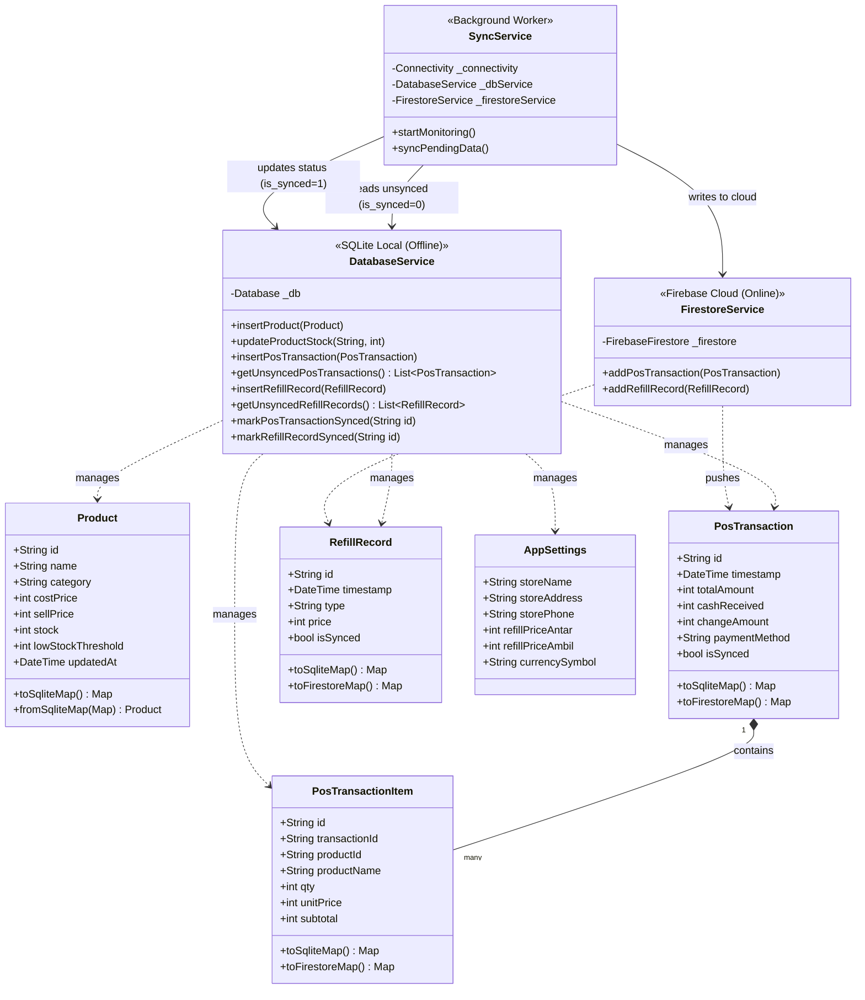

# Class Diagram: Sistem Kasir & Refill Hybrid

Dokumen ini memuat rancangan Class Diagram yang menggambarkan struktur data (*Models*), relasi antar entitas, serta interaksi antara lapisan layanan (*Services*) untuk mengelola arsitektur *hybrid* (SQLite lokal dan Firestore cloud).

