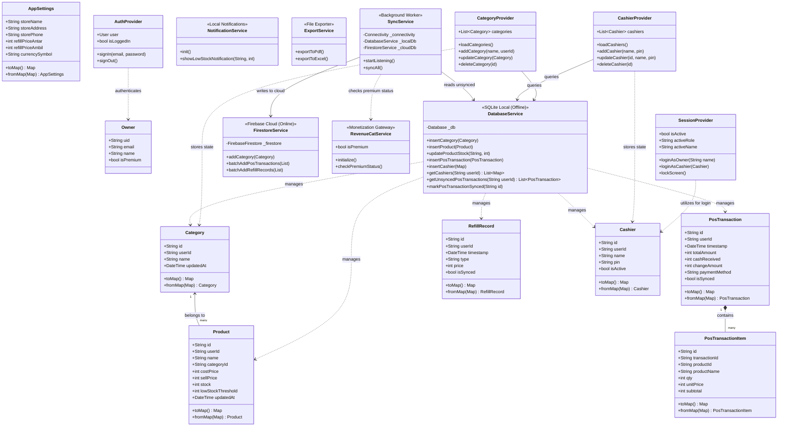

# Class Diagram: Sistem Kasir & Refill Hybrid (Multi-Tenancy & Freemium)

Dokumen ini memuat rancangan Class Diagram yang menggambarkan struktur data (*Models*), State Management (*Providers*), serta interaksi antara lapisan layanan (*Services*) untuk mengelola arsitektur *hybrid* (SQLite lokal dan Firestore cloud) yang terintegrasi dengan sistem *Multi-Tenancy* (berbasis UID) dan *Freemium* (RevenueCat).

